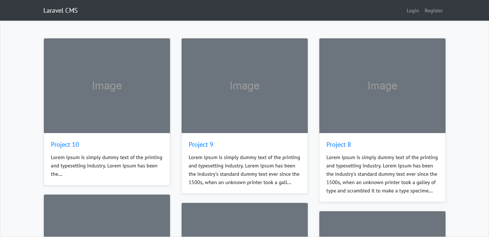
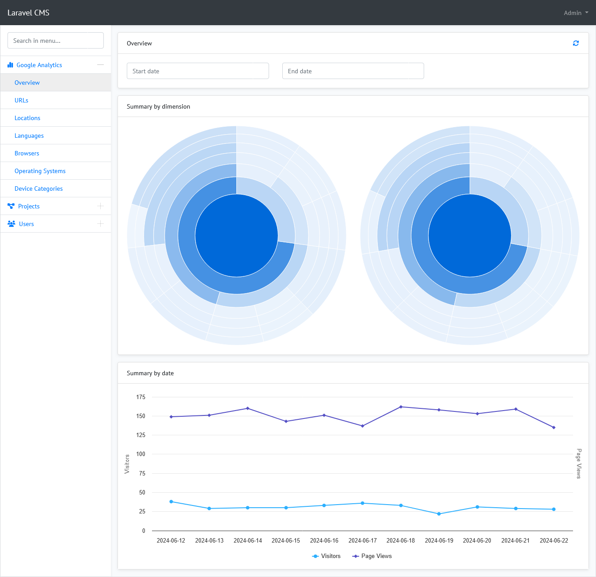
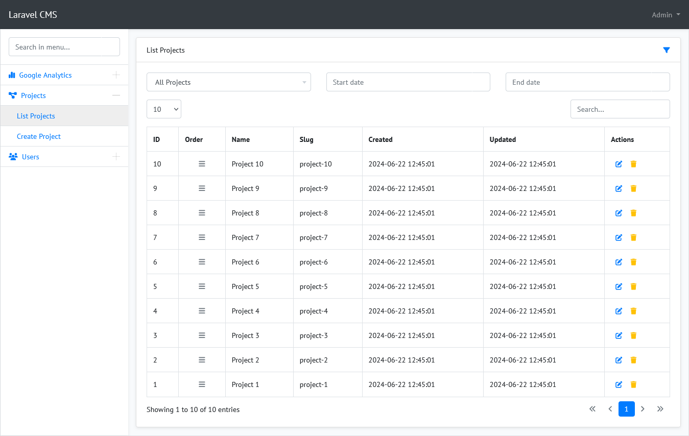
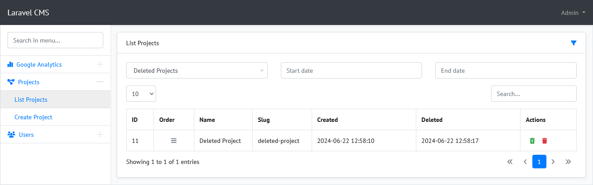
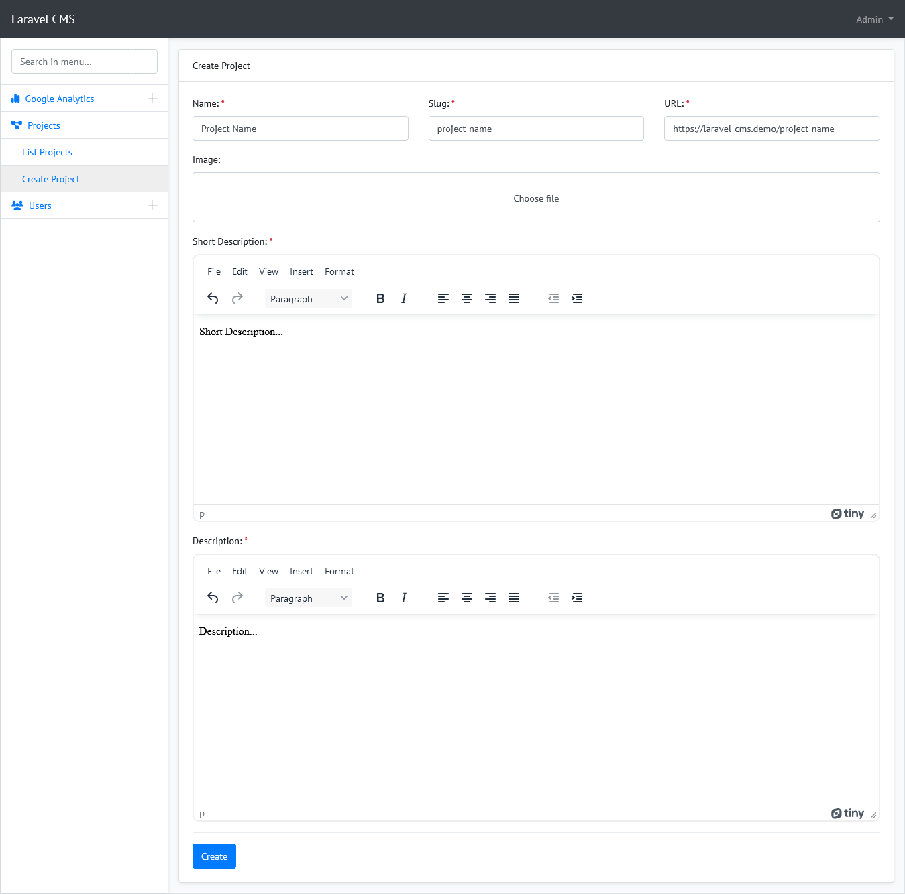
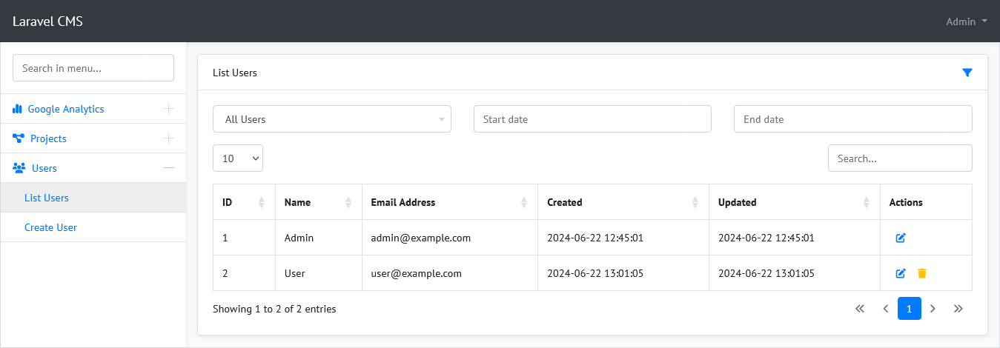
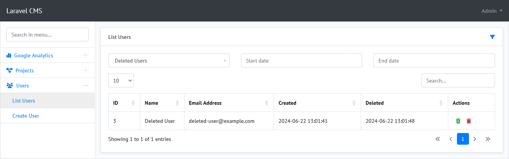
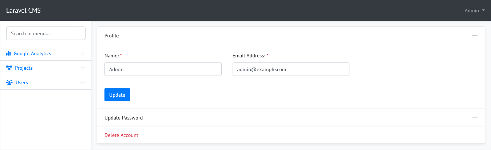
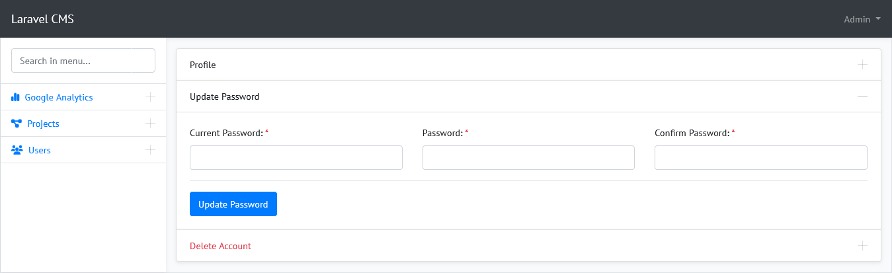
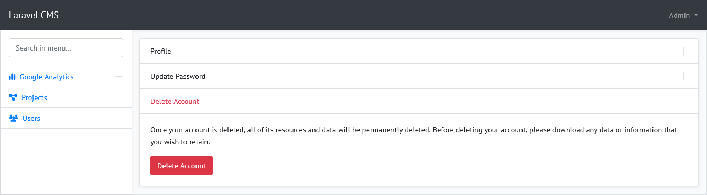

# Laravel CMS

The project is a simple CMS system basically based on the [Laravel 10](https://laravel.com/docs/10.x/installation) and [Bootstrap 4](https://getbootstrap.com/docs/4.6/getting-started/introduction/).

Fully responsive design for all mobile devices and browsers.

Integration with Google Analytics 4 has been made to download and visualize base data.

## Setup

Clone the repo and follow below steps.

1. Run `composer install`
2. Copy `.env.example` to `.env`
3. Run `php artisan key:generate` to generate application key
4. Set valid database credentials of env variables `DB_DATABASE`, `DB_USERNAME`, and `DB_PASSWORD`
5. Run `php artisan migrate --seed` to start all migrations and seed your database
6. Run `npm i` (Recommended node version `>= V18.16.0`)
7. Run `npm run dev` or `npm run prod` as per your environment

## Demo Credentials

### Admin Login

- **Email:** admin@example.com
- **Password:** qwerty

## Credits & References

The following software libraries and other references are utilized in the creation this project.

- [Laravel](https://github.com/laravel/laravel)
- [Laravel UI](https://github.com/laravel/ui)
- [Spatie Laravel Analytics](https://github.com/spatie/laravel-analytics)
- [Yajra Laravel Datatables](https://github.com/yajra/laravel-datatables)
- [Laravel Gates & Policies](https://laravel-news.com/laravel-gates-policies-guards-explained)
- [Laravel Route Organization Tips](https://laravel-news.com/laravel-route-organization-tips)
- [Soft Delete & Restore](https://codeanddeploy.com/blog/laravel/complete-laravel-8-soft-delete-restore-deleted-records-tutorial)
- [Laravel Jobs & Queues](https://shouts.dev/articles/laravel-jobs-and-queues-with-example)
- [Bootstrap](https://getbootstrap.com/)
- [jQuery](https://jquery.com/)
- [UX Solutions Bootstrap Datepicker](https://github.com/uxsolutions/bootstrap-datepicker)
- [Sebastien MALOT Bootstrap Datetimepicker ](https://github.com/smalot/bootstrap-datetimepicker)
- [Jdewit Bootstrap Timepicker](https://github.com/jdewit/bootstrap-timepicker)
- [DataTables](https://github.com/DataTables/Dist-DataTables-Bootstrap4)
- [Highcharts](https://github.com/highcharts/highcharts-dist)
- [NVD3](https://github.com/novus/nvd3)
- [Select2](https://github.com/select2/select2)
- [SweetAlert2](https://github.com/sweetalert2/sweetalert2)
- [TinyMCE](https://github.com/tinymce/tinymce)

## License

The project is open-sourced software licensed under the [MIT license](https://opensource.org/licenses/MIT).

## ScreenShots

### Home

### Google Analytics - Overview

### List Projects

### List Deleted Projects

### Create Project

### List Users

### List Deleted Users

### Profile

### Profile - Update Password

### Profile - Delete Account

